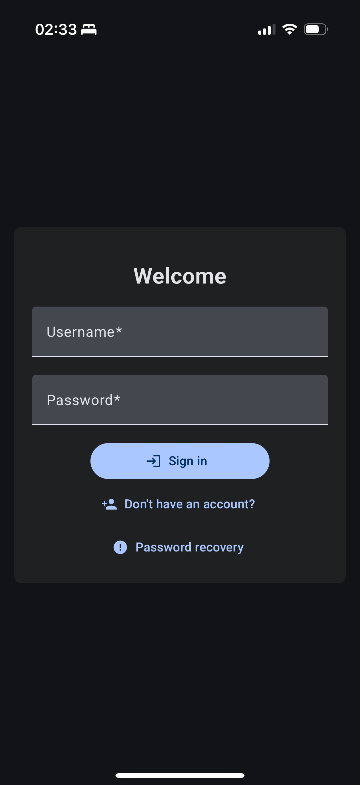
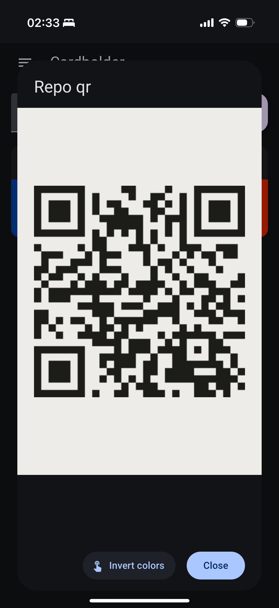

# Cardholder PWA это приложение для хранения ваших скидочных и бонусных карт

- 🇬🇧 [English](/readme.md)  
- 🇷🇺 [Русский](/docs/ru/readme.md)

<p align="center">
  
  
  
</p>

## Демо

- [Демо #1](https://cardholder-pwa.onrender.com)  
- [Демо #2](https://p01--cardholder-pwa--yhc2hsmvw6xy.code.run)

Демо размещено на бесплатных хостингах, которые могут приостанавить работу контейнеров. Это приведет к долгой загрузке - вплоть до минуты.

### Основные особенности

- PWA — можно установить прямо из браузера и использовать даже офлайн (для просмотра)
- Несколько пользователей с ролями владельца, администратора и участника
- Совместный доступ к картам (можно поделиться одной картой или всеми сразу)
- Восстановление пароля по email (если настроен SMTP)
- Простое развертывание
- Открытый исходный код

### Технологии

- Angular - фронтенд
- Python с FastAPI и SQLAlchemy - бэкенд

### Поддерживаемые коды

- TL;DR Это основные 2D (напр. QR) и 1D (напр. штрихкод) типы.
- Приложение использует:
  - [zxing-js/browser](https://github.com/zxing-js/browser) и [quagga2](https://github.com/ericblade/quagga2) для сканирования кодов.
  - [bwip-js](https://github.com/metafloor/bwip-js) для отображения кодов.
- Ссылки на поддерживаемые типы:
  - [Типы `zxing-js`](https://github.com/zxing-js/library?tab=readme-ov-file#supported-formats)
  - [Типы `quagga2`](https://github.com/ericblade/quagga2/tree/master/src/reader)
  - [Типы `bwip-js`](https://github.com/metafloor/bwip-js/wiki/BWIPP-Barcode-Types)
- Можно вручную ввести значение и тип кода - `bwip-js` отобразит его, если он поддерживается.
- Я заметил, что `zxing` плохо справляется с распознаванием светлых кодов на темном фоне. Возможно, это касается и других сканеров.

### Подготовка

- **Переменные окружения** не обязательны, но их можно указать. В [.env.example](/.env.example) перечислены все доступные переменные с описанием. Рекомендую как минимум настроить **SMTP**, чтобы работало восстановление пароля.
- Для работы **PWA** и сканирования через **видеопоток** требуется **HTTPS**-доступ. Я использую отдельный Nginx с сертификатом Let's Encrypt.

### Развертывание

- Через `docker`

```bash
# загрузка образа
docker pull ghcr.io/quenary/cardholder_pwa:1

# запуск контейнера
docker run -d -p 80:80 \
-v $HOME/.cardholder_pwa:/cardholder_pwa \
ghcr.io/quenary/cardholder_pwa:1
```

- Через `docker-compose`

```bash
# поместить один из docker-compose файлов в нужную директорию (или в Portainer)
# docker-compose.sqlite.yml - для локальной БД sqlite
# docker-compose.pg.yml | docker-compose.my.yml - для полноценной БД (по умолчанию отдельный контейнер внутри сети приложения)
docker-compose -f <имя_файла> up -d
```

### Роли пользователей

- **Первый зарегистрированный аккаунт** (после первого запуска или миграции с версии 0.0.13) получает роль **владельца**. На данный момент тот аккаунт нельзя удалить, а роль владельца нельзя передать другому пользователю простым способом.
- Возможно это излишне, но я также добавил роли администратора и участника:
- **Владелец** может:
    - Менять некоторые настройки приложения через интерфейс
    - Назначать администраторов
    - Удалять аккаунты администраторов и участников
- **Администратор** может:
    - Менять некоторые настройки приложения через интерфейс
    - Удалять аккаунты участников

### Общие карты

См. [docs/SHARED_CARDS.md](/docs/SHARED_CARDS.md).

### Участие в разработке и безопасность

Эти документы только на английском:

- [Contributing](/docs/CONTRIBUTING.md)
- [Security](/docs/SECURITY.md)

