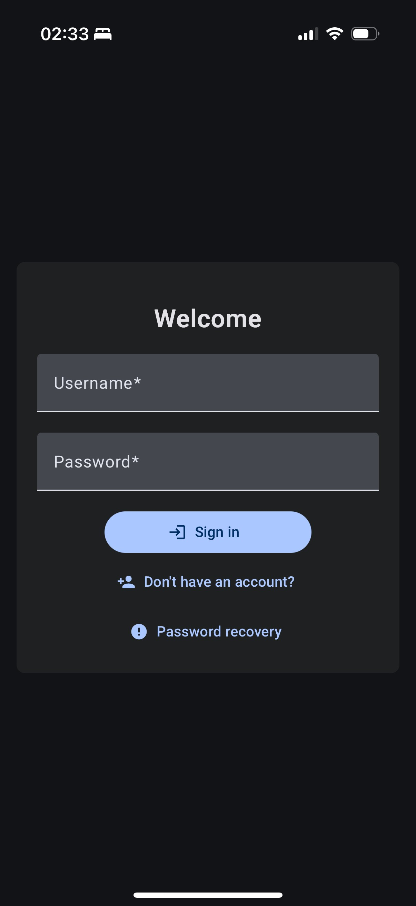
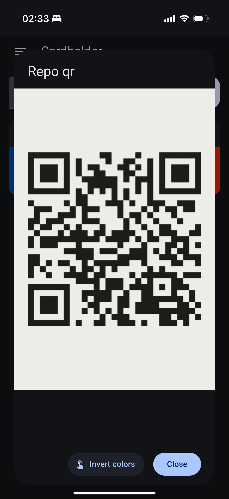

# Cardholder PWA is a self-hosted app for your loyalty and discount cards

- 🇬🇧 [English](/readme.md)
- 🇷🇺 [Русский](/docs/ru/readme.md)

<p align="center">
  
  
  
</p>

## Demo

- [Demo #1](https://cardholder-pwa.onrender.com)
- [Demo #2](https://p01--cardholder-pwa--yhc2hsmvw6xy.code.run)

It's powered by free providers and can be suspended, which will lead to a long initial load - up to a minute, according to their notes.

### Main features:

- PWA - you can install it on device from browser and use even offline (read-only)
- Multi-user support
- Easy to self-host
- Open-source

### Core

- Angular for frontend
- Python with FastAPI and SQLAlchemy for backend

### Supported codes

- TL;DR these are the main 2D (e.g. QR) and 1D (e.g. barcode) types.
- App relies on:
  - [zxing-js/browser](https://github.com/zxing-js/browser) and [quagga2](https://github.com/ericblade/quagga2) for scanning codes.
  - [bwip-js](https://github.com/metafloor/bwip-js) for displaying codes.
- Supported codes:
  - [Types of `zxing-js`](https://github.com/zxing-js/library?tab=readme-ov-file#supported-formats)
  - [Types of `quagga2`](https://github.com/ericblade/quagga2/tree/master/src/reader)
  - [Types of `bwip-js`](https://github.com/metafloor/bwip-js/wiki/BWIPP-Barcode-Types)
- You can enter value and type of the code manually - `bwip-js` will display the code, if it is supported.
- I noticed that `zxing` has a hard time detecting light codes on dark backgrounds. Maybe other scanners are affected by this as well.

### Preparation

- **Environment variables** are not required, but you can still define some. There is [.env.example](/.env.example) containing list of vars with description. I’d recommend setting up at least **SMTP** to enable password recovery.
- For **PWA** and **video-stream** code scanner functionality you need **HTTPS** access. I use a separate Nginx with Let's Encrypt certificate.

### Deploy

- Using `docker`

```bash
# pull image
docker pull quenary/cardholder_pwa:latest

# run container
docker run -d -p 80:80 \
-v $HOME/.cardholder_pwa:/cardholder_pwa \
quenary/cardholder_pwa:latest
```

- Using `docker-compose`

```bash
# place one of the docker-compose files to desired location (or in Portainer)
# docker-compose.sqlite.yml - for local sqlite db
# docker-compose.pg.yml | docker-compose.my.yml - for full-featured db (separate container in the app network by default)
docker-compose -f <filename> up -d
```

### Account roles

- **The first registered account** (after deployment or migration from version 0.0.13) will be assigned to the **owner** role. For now this account cannot be deleted and owner role cannot be reassigned in a convenient way.
- Might be an overkill, but just in case, i also added admin and member roles.
- The **owner** can:
  - Change some app settings from the UI
  - Assign admin role to other members
  - Delete admins or members accounts
- The **admin** can:
  - Change some app settings from the UI
  - Delete members accounts
